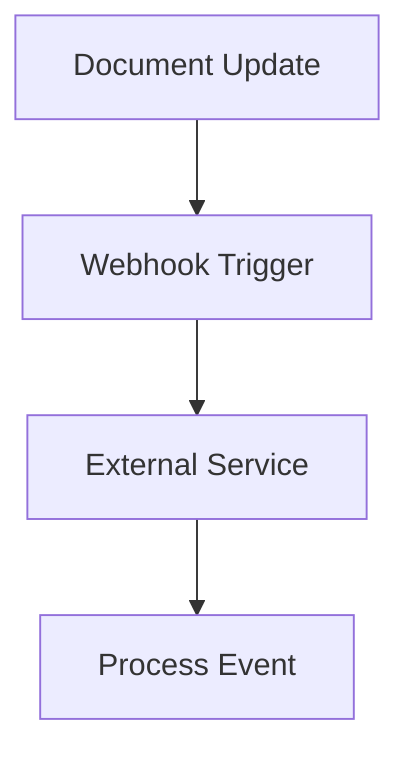

## Overview

You integrate Yashwanth Documentation API to automate document management. Endpoints handle CRUD operations on docs. Authenticate requests with API keys for security.

<Callout kind="info">
  Generate an API key from the settings panel. Store it securely to avoid exposure.
</Callout>

<Columns cols={2}>
  <Card title="RESTful Design" icon="api">
    Follow standard HTTP methods for consistency.
  </Card>
  <Card title="Rate Limits" icon="clock">
    Respect `<= 100` requests per minute to maintain performance.
  </Card>
</Columns>

## Authentication

Secure your API calls with Bearer tokens. Include the header in every request. Tokens expire after 24 hours; refresh as needed.

```javascript
// Example auth header
const headers = {
  'Authorization': `Bearer ${API_KEY}`
};
```

<Steps>
  <Step title="Get API Key" icon="key">
    Navigate to account settings and copy the key.
  </Step>
  <Step title="Make Request" icon="send">
    Use the key in your HTTP client.
    
    ```python
import requests

response = requests.get('/api/docs', headers={'Authorization': f'Bearer {API_KEY}'})
print(response.json())
    ```
  </Step>
  <Step title="Handle Errors" icon="alert-circle">
    Check status codes for issues.
  </Step>
</Steps>

## Core Endpoints

Access documents programmatically. List all docs or retrieve specific ones. Create new entries with POST requests.

<Tabs>
  <Tab title="List Documents" icon="list">
    Fetch a paginated list.
    
    <Request tabs="JavaScript,cURL">
      ```javascript
      fetch('/api/documents?limit=10', {
        headers: { 'Authorization': `Bearer ${token}` }
      }).then(res => res.json());
      ```
      ```bash
      curl -H "Authorization: Bearer YOUR_KEY" "https://api.example.com/documents?limit=10"
      ```
    </Request>
    
    <Response tabs="200">
      ```json
      {
        "documents": [
          { "id": 1, "title": "Intro" }
        ],
        "next": null
      }
      ```
    </Response>
  </Tab>
  <Tab title="Create Document" icon="plus">
    Add a new document.
    
    ```javascript
    const newDoc = { title: 'New Doc', content: 'Hello' };
    fetch('/api/documents', {
      method: 'POST',
      headers: {
        'Authorization': `Bearer ${token}`,
        'Content-Type': 'application/json'
      },
      body: JSON.stringify(newDoc)
    });
    ```
  </Tab>
</Tabs>

<Expandable title="Error Handling" default-open={true}>
  Manage common API errors.
  
  | Code | Meaning | Action |
  |------|---------|--------|
  | 401 | Unauthorized | Refresh token |
  | 429 | Rate limited | Wait and retry |
  | 500 | Server error | Contact support |
</Expandable>

## Webhooks

Set up webhooks for real-time notifications. Trigger events on document updates. Configure payloads to suit your system.



You now connect Yashwanth Documentation seamlessly. This integration reduces manual tasks by automating workflows. For troubleshooting, see the dedicated page.

## Best Practices

Validate inputs to prevent errors. Use pagination for large datasets. Log requests for auditing purposes.

Your API usage enhances productivity. Monitor endpoints for optimal performance with `>= 99%` uptime.